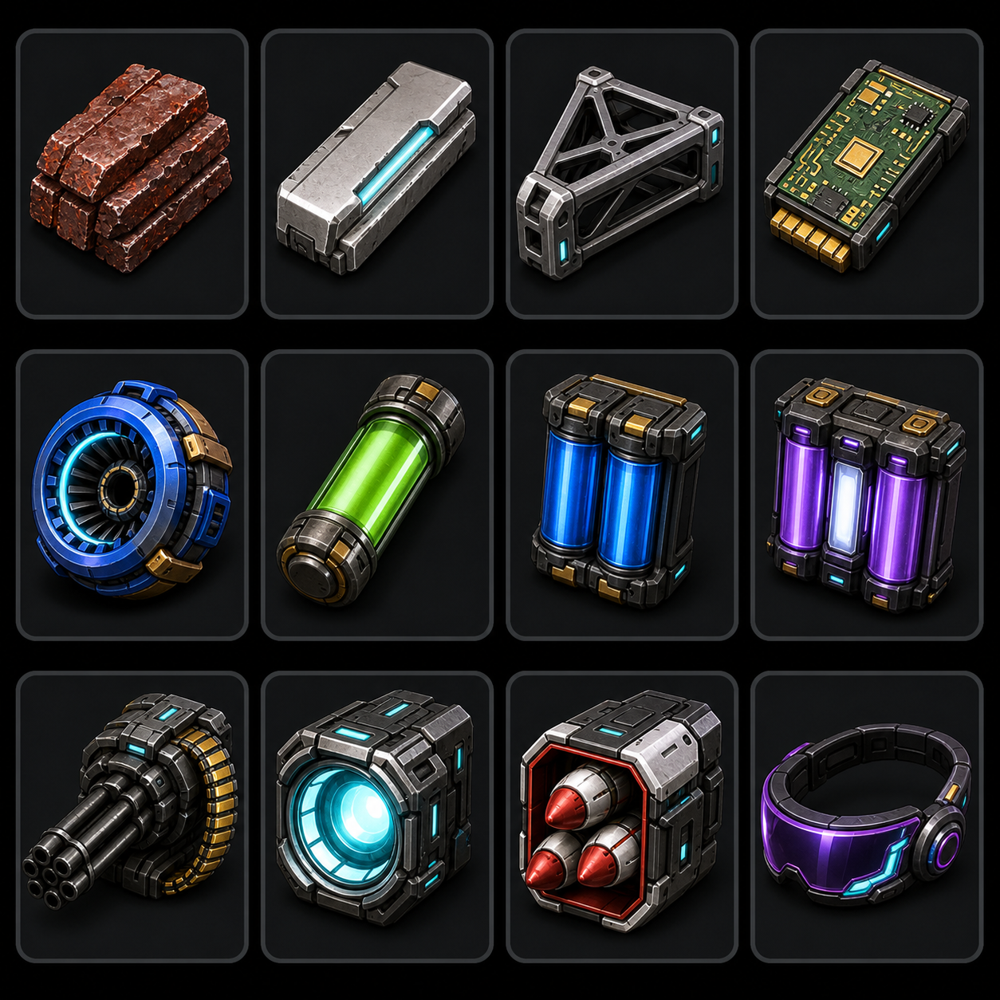
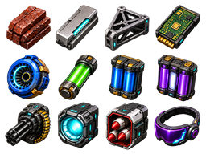
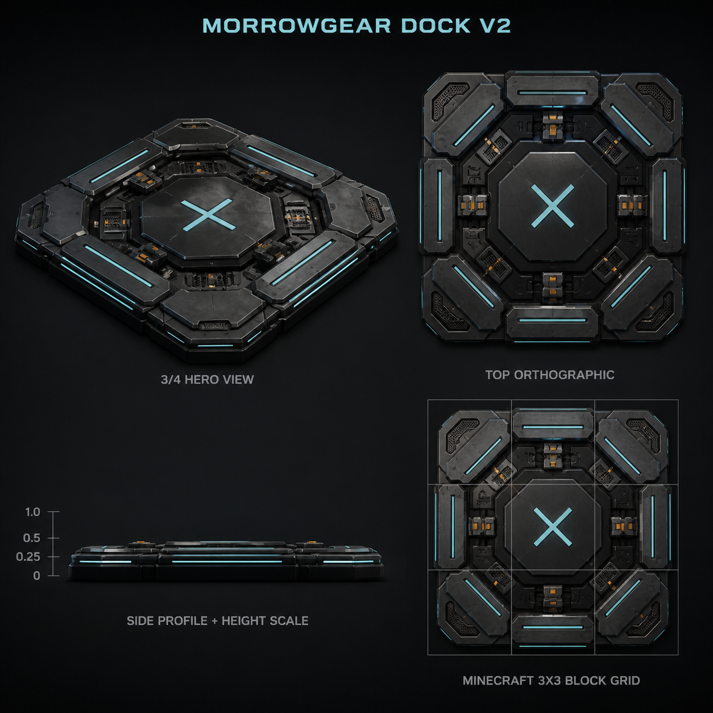

# Morrowgear 装備デザイン案 V2

**状態:** Dock V2、追加アイテムV3承認済み  
**ゲーム反映:** 実装済み

## 追加アイテム

既存のField Drone Unit、役割モジュール、Controllerと同じ暗色装甲、シアンの埋込表示、オレンジの整備ラッチを継承する。色だけに依存せず、32pxでも輪郭で識別できることを条件とする。V3では輪郭に加え、素材、動力、兵装、装着品を主色でも分離する。

- 未焼結モロウ材: 層状で荒い複合材ビレット
- モロウ合金: 精錬された一体型インゴット
- 軽量フレーム: 中空の構造フレーム
- 基礎制御基板: 密閉型制御ユニット
- 飛行アクチュエータ: リング状駆動部
- バッテリー3段階: 1セル、2セル、3セルで容量差を表現
- 機関砲モジュール: 給弾部と砲身を持つ兵装Pod
- レーザーモジュール: 集光リングと射出口
- ミサイルモジュール: 密閉型マイクロミサイルラック
- 戦術バイザー: 薄型の装着式HMD

## Dock V2

3x3、支柱なし、四辺と上方から進入可能という既存契約を維持する。高さは最大約0.35ブロックに抑え、次の機構で立体感を増やす。

- 多層ベベル外装
- 中央の低い着艦盆地
- デッキへ格納された4つのセンタリングクランプ
- 保護された充電接点と整備溝
- 低い四辺ガイドと埋込誘導灯
- 役割を持たない装飾的な高構造物は追加しない

## 実装段階

1. Dock V2を3x3の位置別Java block modelへ数値分割し、低床着艦座標へ合わせる。
2. 当たり判定を外形へ合わせつつ、上方・四方向の進入回廊を維持する。
3. Dockの配置、着艦、ローター停止をMinecraft内で比較確認する。
4. 追加アイテムV3は透過正本から64pxテクスチャへ変換し、安定した既存アイテムIDへ適用する。
