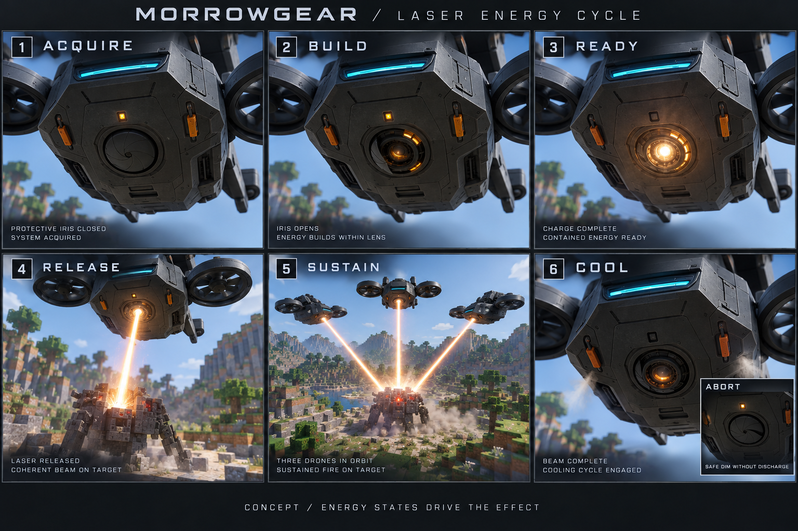

# プレイ体験を強めるアクション演出設計
日付: 2026-09-20 / 状態: 提案、未実装
参照: CombatPolicy、CombatEffectRenderer、FormationTrailControllerを確認。画像は内蔵画像生成ツールによる演出概念図。幾何学的な正確さ、アニメーション品質、ゲーム内性能を検証した画像ではない。

## 狙い
準備で期待を作り、実行で力を感じさせ、終了で機械の働きを納得できるようにする。単機の気持ちよさ、複数機の連携、遠景での美しい動きを同じ製品の表現にする。
常時強い発光や音で飽和させず、実際の成功や連携が見える瞬間へ強度を集中する。

## レーザーの連続コマ

| 段階 | 見せ方 | 駆動する実情報 | 中断時 |
|---|---|---|---|
| 捕捉 | 照準部が対象へ向き、武器側の灯だけ変化 | 有効な対象と戦闘状態 | 対象解除、誤った相手へ先行照射しない |
| 準備 | 保護絞りが開き、奥のレンズが現れる | 実際の充填開始 | 開度を連続的に戻す |
| 蓄積 | レンズ内部の環状区画が外側から内側へ点灯、中心へ密度を集める | 正規化した充填率 | 外向き放電なし、内部だけ減衰 |
| 完了待ち | 芯が白金色となり、充填率を保持 | 充填完了と発射許可を分離 | 待ち時間に応じ光や音を無限増大させない |
| 発射 | 実射出口から実照射点へ切れない芯、短い局所的な立ち上がり | サーバー側の照射開始と同一対象 | 開始前に対象を再検証 |
| 継続 | 白い芯、薄い橙色外層、射出口と接触点に限定した残光 | 実照射状態・照準点・熱量 | 射線喪失や停止の通知で直ちに光線終了 |
| 終了 | 光線消灯、内部残熱、ラッチ作動と小さい排熱 | 実際の照射終了と熱量 | 次の行動へ遷移したら重ねず短縮 |
| 再開 | 残熱状態から自然に充填・照射へ接続 | 新たな有効な攻撃サイクル | 冷却演出の完走を発射条件にしない |

保護絞り、ラッチ、排熱部は新しい外観提案であり、現行モデルに既に存在する部品ではない。
画像内の機体上面、脚、対象の形状は前のモデル案と細部が異なるため、モデル正本には使わない。照射点の火花は上限を抑え、以前不評だった巨大な着弾エフェクトへ戻さない。

## 実装との接続
確認したCombatPolicyには基本充填64tick、同期窓24tick、解放タイムアウト60tickの定数がある。これは定義の確認であり、全経路で同じ継続時間になるという実測結果ではない。
CombatEffectRendererはcombatCharge、combatStateAge、ageInTicksを用い、充填は複数の円盤とリングで描いている。現在のlaserOutletはforwardと固定オフセットから計算されている。
新規モデルではlaser_aperture、gun_muzzle、charge_contact、vent、tow_anchorなどの取付原点をメッシュと描画で共有する。固定オフセットが新しいモデルに一致するとは推測しない。姿勢変換を二重適用しないことも検査する。
演出状態は機体の移動状態から推測せず、対象ID、攻撃サイクルID、武器状態、照準点、充填率、熱量、終了理由を整合した一組として取得する。不足情報は実装時に追加する。
旧サイクルの遅延イベントは破棄し、開始イベントを重複再生しない。途中から視界に入った際は現時点の演出へ接続し、過去のフレア・発射音を再演しない。

## 群での見せ場
- 発艦: 実際に離陸した機体からローターと誘導灯が立ち上がり、編隊参加が目で追える。
- 編隊: 参加順の軌跡立ち上がり、隊形そのものが見える適度な太さ。catch-up/rejoinも既存ポリシーの対象を維持して調整する。
- 攻撃進入: 実際に任務を離れて攻撃へ入った機体だけ短いフレア。状態の揺れで繰り返さない。
- 複数レーザー: 各機の実際の準備状態が灯で分かり、照射機が増えるほど集束点の密度を増す。全機準備完了を待つ新たな条件は追加しない。
- 機関砲: 揃った攻撃経路、左右にずれた曳光、点から線へ続く着弾。発射間隔や威力はこの演出変更では変更しない。
- 充電: 子機射出、接点へ整列、給電、消灯、子機帰投が連続して見える。給電していない相手にビームを出さない。
- 回収: フック接続、張力の発生、吊上げ、運搬、着地・解除が伝わる。吊荷の揺れは表示だけで衝突位置と乖離させない。
- 作業: 処理順が分かる照射と切替。Scout走査、Engineer処理、Cargo回収を別の動きで識別する。
- 帰投: 巡航から接近、接地、回転停止、接点点灯へ。充電や補給中の進み具合が状態灯とUIで一致する。

## 中断と整合の規則
演出は任務判断・衝突回避・ダメージ・充電判定の入力にしない。外観の都合で高度、速度、目標、発射条件を変えない。
モデル部品の開閉は飛行や攻撃をブロックしない。早い状態変化には短縮・連続補間で追従する。
目標死亡、別目標への切替、遮蔽、武器切替、電力切れ、帰還、機体削除、描画範囲外、次元移動、ワールド終了をそれぞれ終了理由として扱う。
光線と銃弾は壁越しに描画しない。遮蔽判定とカメラの深度判定を区別し、照準点が更新されないときに別の標的へ誤接続しない。
一時停止で演出時間を進めない。低FPSでもtick補間を使い、処理落ちで明滅周期が変化しないようにする。
POWER LOSTはローター・飛行音・給電していない発光を停止。必要な回収情報だけ継続する。

## プレイを妨げない制限
- フラッシュは射出口近傍のみ。全画面白飛び、強制カメラ揺れ、連続ストロボは基本OFF。
- 遠景は光線の芯と状態灯を残し、火花・湯気・微小パーツから省略する。
- 多機は画面全体の粒子、光源、同時音声の予算を設ける。プレイヤー危険・固定対象・近接動作を優先する。
- 同時照射数が多くてもアルファ加算を無制限に重ねず、視認性のために上限を設ける。
- 日中、夜間、水中で読み取れる強度を別に評価し、発光材と実際の周囲光源を混同しない。
- 演出品質、閃光軽減、音量を調整可能にし、最低設定でも実行状態・対象・警告を読み取れる。
- 音は機体位置と距離に従う。近くの多数機は無制限に足し算せず、レーザーの高音を抑える。

## 実装後の評価
「派手か」だけでなく次の問いで評価する。現段階では未試験。
1. 音なしでも充填・準備完了・発射・中断・冷却を見分けられるか。
2. 実行対象とビーム・弾道の接続先が全フレームで一致するか。
3. 1/3/8機、複数目標、混成機種、100機運用で注目対象が読み取れるか。
4. 中断・再開・武器変更で光や音が残留せず、必要な攻撃が妨げられないか。
5. 正面・側面・底面・遠景とGUI倍率別で機構が破綻しないか。
6. 昼夜、遮蔽物、低FPS、低品質設定でも光線が欠けたり壁を透過したりしないか。
7. 連続プレイで眩しさ・高音・反復音が負担にならないか。本人の体験確認を含める。
8. 既存の攻撃、編隊、帰還、補給、サルベージ試験が退行しないか。

