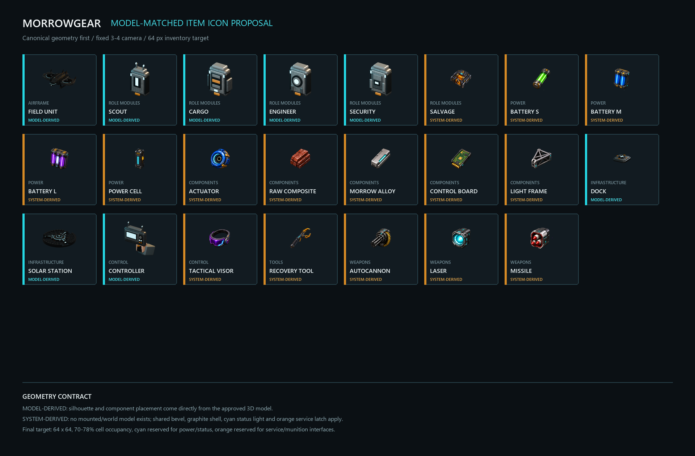

# Morrowgear モデル整合アイコン案

**状態:** デザイン承認待ち。ゲーム内テクスチャ未変更。

## 目的

アイコンを独立したイラストとして描かず、承認済み3Dモデルと同じ輪郭、部品配置、前後方向を持つ縮小表現へ統一する。全アイテムで暗色装甲、シアンの状態表示、オレンジの整備・弾薬接点を共有するが、色だけで種類を識別させない。

## 生成区分

### MODEL-DERIVED

承認済みモデルまたは実装済みブロック形状を正とする。固定した斜め前方の正投影カメラから透過レンダリングし、輪郭を維持したまま64pxへ縮小する。

- Field Drone Unit
- Scout / Cargo / Engineer / Security Module
- Dock
- Solar Service Station
- Controller

### SYSTEM-DERIVED

独立した装着モデルまたはワールドモデルがまだ存在しないため、Morrowgearの部品規則から設計する。将来3Dモデルが追加された場合はモデル由来へ移行する。

- Salvage Module
- バッテリー、電力部品、中間素材
- Tactical Visor、Recovery Tool
- Autocannon / Laser / Missile Module

## 固定規則

- 出力は64x64 RGBA。
- アイコンの不透明領域はセルの70〜78%を基本とする。
- カメラは斜め前方の正投影とし、機首・前面を左下へ向ける。
- 黒鉛装甲を主面、シアンを電力・状態表示、オレンジを整備ラッチ・弾薬接点へ限定する。
- MODEL-DERIVEDは輪郭、主要部品数、部品の左右関係、前後方向を変更しない。
- SYSTEM-DERIVEDも同じ面取り半径、装甲の積層、発光部の埋込深さを使う。
- 64pxと32pxの両方で、輪郭だけから用途群を区別できることを確認する。

## 承認後の実装手順

1. MODEL-DERIVEDを正規Blenderモデルから再レンダリングする。
2. SYSTEM-DERIVEDを同じカメラ・照明・占有率へ再構成する。
3. 64pxおよび32px比較ボードで識別性を確認する。
4. 承認後にのみゲーム内テクスチャへ差し替える。
5. インベントリ、手持ち、設置物、召喚機体をMinecraft内で比較する。
