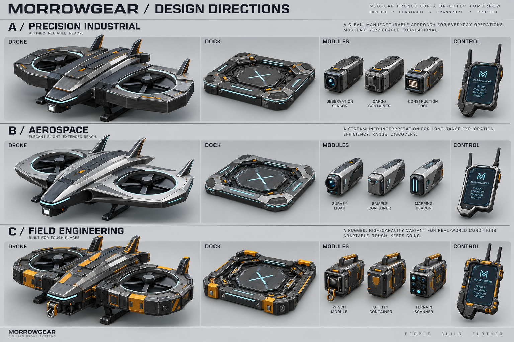

# Morrowgear 製品群デザイン比較案
更新: 2026-09-20
状態: 外観方針の提案。ユーザー承認前。ゲーム実装・既存アセットの変更なし。

## 世界観
Minecraftの資源から作る探索・開拓・輸送・防衛用の無人作業機械。整備、補給、回収して長く使う製品群として設計する。今回の民生由来という位置付けは提案であり、既存兵装を削除する意味ではない。

## 比較画像

| 案 | 造形 | 材質と識別 | 向く役割 |
|---|---|---|---|
| A 精密工業型 | 低い胴体、面取り装甲、埋込バイザー、交換式カートリッジ | 黒鉛色と金属の稜線、小さな整備ラッチ | 全製品の共通基盤 |
| B 航空機型 | 長いノーズ、連続した外装、薄い翼状ダクト外装 | 銀色パネルと暗い機構部の対比 | Scout、軽量探索装備 |
| C 開拓重機型 | 保護されたダクト、交換パネル、取手、ウインチ | 暗色装甲と限定的な黄橙色の整備面 | Engineer、Cargo、Salvage |

推奨はAを基盤とし、B/Cを用途別の変形として採用すること。メーカー、時代、接続規格が異なるような混在は避ける。

## 共通設計契約
- 通常機の双発ダクテッドローター、低い機体、長い機首、埋込バイザーを継承する。既存Salvageの4ローター構造は別途維持して設計する。画像のCは造形方向の比較用でありSalvage確定モデルではない。
- 通常Dockは3x3の低床、支柱なし、上方・四方の進入空間を維持する。縦積み、当たり判定、着艦位置は実装時に照合する。
- 共通のモジュール接続面を定義し、用途をレンズ、荷室、工具、給弾機構、ウインチで表す。画像中のモジュール名や具体的な新機能は実装仕様の追加を意味しない。
- シアンは電力・通信、アンバーは注意、赤は戦闘・危険。静的なオレンジの整備ラッチと動的な注意灯は場所と点滅で区別する。
- 見分けやすさは形状を優先する。全アイテムを暗色とシアンだけに染めず、素材・用途に応じた材質差を残す。
- Controllerはアンテナ付き手持ち端末。画面の向き、持ち手、手との干渉は持ち状態の比較で決める。
- アイコンは承認されたモデル正本から生成し、32px/64pxで輪郭と用途の識別を確認する。

## 今回の確認範囲と未確認事項
画像生成ツールで参考画像を与えて作成した概念比較図であり、実モデルのレンダーではない。3D形状の左右対称性、寸法、モデル一致率、当たり判定は未検証であり、数値的な一致率は提示しない。

目視では3案の機体・Dock・モジュール・端末の対応、通常機の左右2ローター、低床で支柱のないDock、造形の違いを確認した。図内のロゴ、英語コピー、細かな表記は生成画像の仮表現であり、正式採用ではない。

Solar Service Station、充電子機、バイザー、全ロール機、兵装、中間素材、UIは今回の代表比較図には網羅していない。選定した方向を展開する際は、それぞれの現在の機能と構造を確認して個別に設計する。

## 選定後の制作順序
1. 選んだ造形を部品表、寸法、接続面、色の用途として確定する。
2. 共通機、Dock、モジュールを単一の正本メッシュで作成し、前後左右・上下面を比較する。
3. 同じ規則を各ロールと設備へ展開する。見た目だけを理由に機体数や性能を変更しない。
4. 同じ正本からアイコンを作る。縮小時は装飾を整理しても主要部品や輪郭は変更しない。
5. 昼夜、上下・遠近、手持ち、インベントリで実機確認し、飛行・着艦・照射位置と外観の整合を確認する。

## 制作記録
内蔵画像生成ツールを使用。入力はField V5の既存レンダーとDock V2承認画像。最終プロンプトは同フォルダーのPROMPT.txtに保存。

