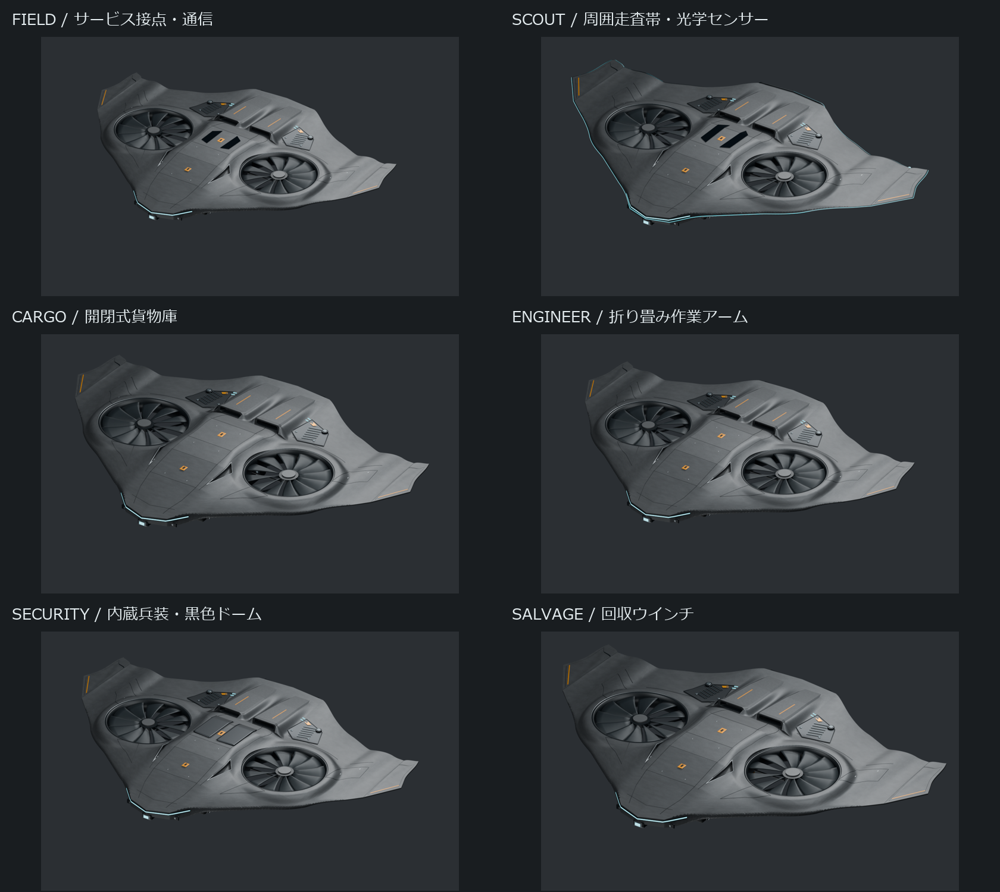
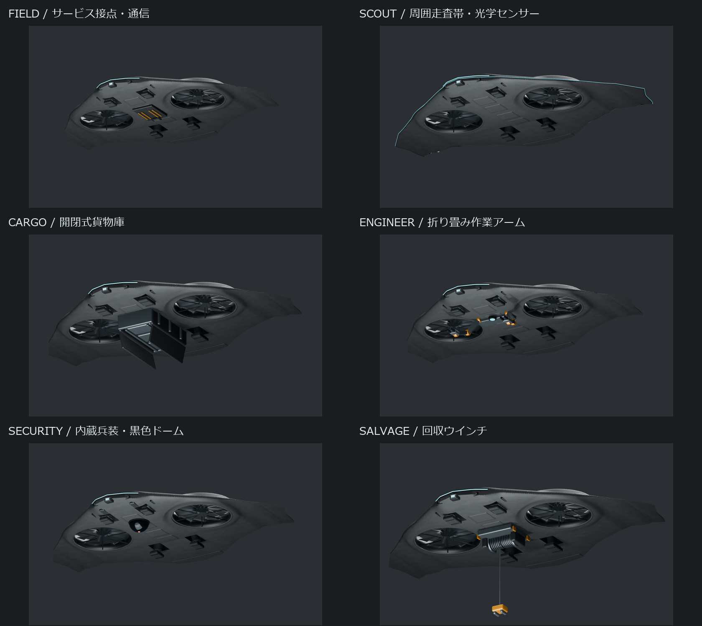
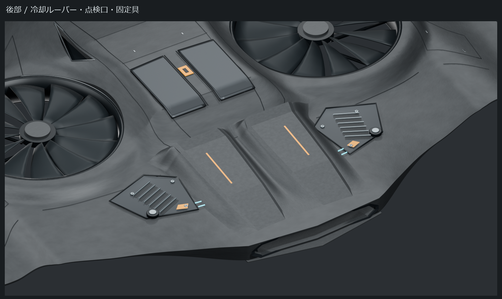
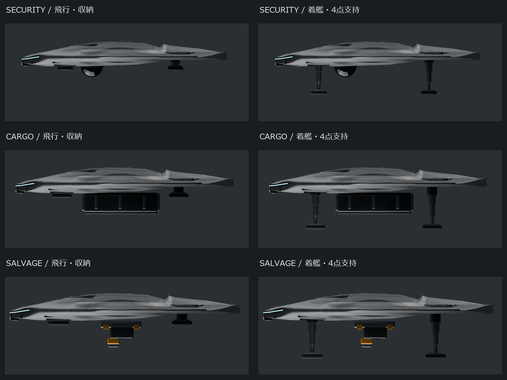

# V20 各役割の装備・後部ディテール・着陸脚

## 位置付け

V19の薄い胴体と水平に近い外翼を共通母体にした、6機種の実メッシュによる提案。
PNGは各 `.blend` のレンダリングであり、画像生成による完成予想図ではない。
この段階ではゲームのモデル、当たり判定、状態遷移、アイコンを差し替えていない。
V19の原本は変更せず、役割別の追加部品と機構を別ファイルに保存している。

構造部品はX=0で左右対称。Scoutの走査点だけは、周回する発光演出なので瞬間的な左右対称性の対象外とする。
形状確認の合格は、ユーザーのデザイン承認や、実機としての飛行可能性を意味しない。

## 共通形状と機種差

胴体・ファンの相対配置を保ち、外翼の横方向の長さと機体全体の大きさを調整した。
上からは同じシリーズと分かる外形、横・下からは装備で役割が分かる方針。
装備をインテークやローター開口から突き出さない。

| 機種 | 全体倍率 / 外翼部分の横倍率 | 装備の外観 |
|---|---|---|
| Field | 0.92 / 0.84 | コンパクトな機体。下面のサービス接点、データポート、低い通信部 |
| Scout | 1.00 / 1.22 | 長めの外翼。前方の2眼光学系、機体外周の走査帯、背面受信部 |
| Cargo | 1.06 / 0.96 | 下面の貨物庫、荷物、保持レール、左右に開く底扉、補強リブ |
| Engineer | 1.00 / 0.90 | 下面の荷重支持部、左右の折り畳み2節アーム、グリッパー、作業照射口 |
| Security | 1.00 / 1.00 | 埋め込み機銃、背面開閉式マイクロミサイル庫、下面の黒い半球型集約口 |
| Salvage | 1.12 / 1.08 | 大きめの機体。荷重フレーム、巻き上げドラム、ケーブル、回収クランプ |

倍率はV19に対する造形上の比率であり、速度・容量・攻撃力を変更しない。
外翼倍率は中心から3.02モデル単位より外側だけに適用する。Fieldの接点等も新しいゲーム機能の実装を意味しない。

## 後部インテーク左右

単に凹凸を足すのではなく、左右に次の機能を表す同形の整備カセットを設けた。

- 冷却ルーバー6列と暗い溝。
- 外周の合わせ目とパッキン。
- 脱落防止を意図した固定具と工具溝。
- 点検用カプラーと蓋。
- アンバーの解除ラッチと小さな状態灯。

カセット面は母体表面の高さに沿って分割しており、吸気口を塞ぐ箱や高いフィンは追加しない。
Scoutの走査帯は排気口の上縁へ逃がす。吸排気の既存確認用レイを、新しい部品を含む全体に対して再実行する。
これは開口を横切らないことの幾何確認であり、冷却性能や流量の解析ではない。

## ランディングギア

滑走用の車輪ではなく、垂直着艦向けの4点支持パッドを採用した。
前後・左右の4箇所をファン内側に配置し、中央下面を役割装備に空ける。
基部の固定筒、入れ子になる中空スリーブ、最終段の支柱、金属製パッド上面、接地ゴム、トレッドを分けてモデル化した。

収納時は下面の脚庫に引き込み、接地パッドと短い機構が下面に残る。完全に平滑な蓋で閉じる構造ではない。
展開時は同じ軸に沿って伸縮し、左右に少し開くが接地パッドは水平を維持する。
各段の長さ0.38、展開時の段間移動0.32で、隣接段に0.06モデル単位の重なりを残す。
固定筒と最上段にも展開時の重なりを確保する。

CargoとSalvageは、同じ機構のパッドを大きくし、伸長量を増やした。
標準脚のパッドは0.30×0.48、重作業脚は0.34×0.56モデル単位で、それぞれに機体倍率を掛ける。

| 機種 | 着地面から、収納した脚以外の最下面までの隙間 |
|---|---:|
| Field | 約0.658 |
| Scout | 約0.851 |
| Cargo | 約0.459 |
| Engineer | 約0.405 |
| Security | 約0.523 |
| Salvage | 約0.343 |

表はモデル単位。Minecraftのブロック数ではない。最終的なゲーム内縮尺を掛けて評価する必要がある。
4つのパッドの接地面は同一平面。脚以外の装備が接地面より下に出ないことを、着艦ポーズで確認する。
これは重心・強度・転倒安定性の計算ではなく、ゲーム用モデルの幾何条件。

## 可動ポーズ

`.blend` と `.glb` は、次の確認用アニメーションを持つ。
それぞれの役割動作を分かりやすく並べたもので、ゲームの全状態遷移を代替するものではない。

| フレーム | ポーズ |
|---|---|
| 1、20 | 脚展開。作業アーム・ケーブル・貨物扉・兵装庫は収納 |
| 40 | 脚収納。通常飛行 |
| 60〜100 | 脚収納のまま役割装備を展開。80で代表作業ポーズ |
| 120 | 作業装備を収納し、脚を展開 |

左右の脚・扉・アームは、書き出し時に動きが崩れないよう、左右反転した実際の親子階層で構成する。
Blender固有の、動く部品に対するMirrorモディファイアだけに依存しない。
GLBには部品別に分離された多数のクリップではなく、共通時間軸の確認用クリップを出力する。

Scoutの点は外周帯に沿って巡回する。Securityは開閉庫と照射口の発光を表現するが、ミサイル発射や攻撃処理はこのモデル試作では変更していない。
ローターブレードは既存の実形状を残している。今回の確認用クリップに回転駆動は追加していない。

## ゲームに接続する際の条件（未適用）

| 運用状態 | 接続時に必要な条件 |
|---|---|
| 通常飛行・隊形航行 | 脚収納。収納部品が体積を増やさない状態を基本とする |
| 作業 | 作業対象との距離、地形、脚庫との干渉を確認して装備を展開 |
| 着艦進入 | アーム・貨物扉・兵装庫・回収クランプを収納した後に脚展開 |
| Cargo荷役 | 底扉を開くための空間が必要。閉扉で算出した地上隙間を開扉状態へ流用しない |
| Salvage着艦 | 吊り荷がある場合は先に荷下ろし。装備収納の完了を着艦許可条件にする |
| Dock上 | 機体原点ではなく接地パッドの面をDock接触面へ合わせる |
| POWER LOST | 演出完了を待って浮遊させない。既存の墜落・回収処理を優先する |

装備の収納不能時は、無期限に着艦待ちやホバリングへ固定しない。
使用可能電力と現在の危険度に応じた安全な代替動作、タイムアウト、既存任務の再開条件を、ゲーム側への接続時に定義・試験する。
今回の外観更新だけでゲームの任務キューやDockとの契約を変更しない。

## 確認物と限界

各機種フォルダーに `.blend`、`.glb`、13方向・状態のPNG、`all-views.png`、`validation.json` を保存する。

確認内容:

- 6機種それぞれ11時点で、構造部品の左右対称性、4点接地の平面性、脚とファン開口の位置関係。
- 着艦ポーズでの地上隙間、母体の閉じた体積、役割部品の存在。
- 扉の閉鎖位置と開放角、閉じた兵装庫からミサイル先端が突き出ないこと。
- 追加部品を含めた吸排気口の確認用レイ。
- 13枚のPNGが最新モデルから生成され、機体が画面内に収まること。
- GLBに4脚と左右扉の動き、左右反転の親子関係、共通アニメーションが含まれること。
- GLBをBlenderへ再取り込みし、同じ11時点で全パーツの位置範囲を元モデルと比較すること。

記録は `output-checks.json` と `export-roundtrip.json`。単なるファイル存在確認と、読み戻した実形状の比較は分ける。

未確認:

- 全可動部の連続的な干渉検査、実機の機械強度、重心、飛行・冷却解析。
- 新モデルのMinecraft内での描画、当たり判定、Dock接触、状態遷移への接続。
- ゲーム用の最終UV・テクスチャベイク、LOD、100機時の描画負荷。

Blenderの質感には手続き型マテリアルが含まれる。GLBの幾何と可動ポーズが一致しても、Blenderとゲームの照明・材質が同一になるという意味ではない。
画像との完全一致やゲーム実装完了を、この試作の合格から推定してはならない。

## 再生成

Blender 5.2で `tools/drone-design/blender/build_role_family_v20.py` を実行する。
`--role scout` のように機種指定、`--preview` で少数ビューの試作が可能。
通常実行後、`tools/review_role_family_v20.py` で一覧と出力チェックを生成し、
Blenderで `tools/drone-design/blender/verify_role_family_v20_export.py` を実行して読み戻しを検証する。

このフォルダーだけを更新する。承認前にゲームへコピーしない。
